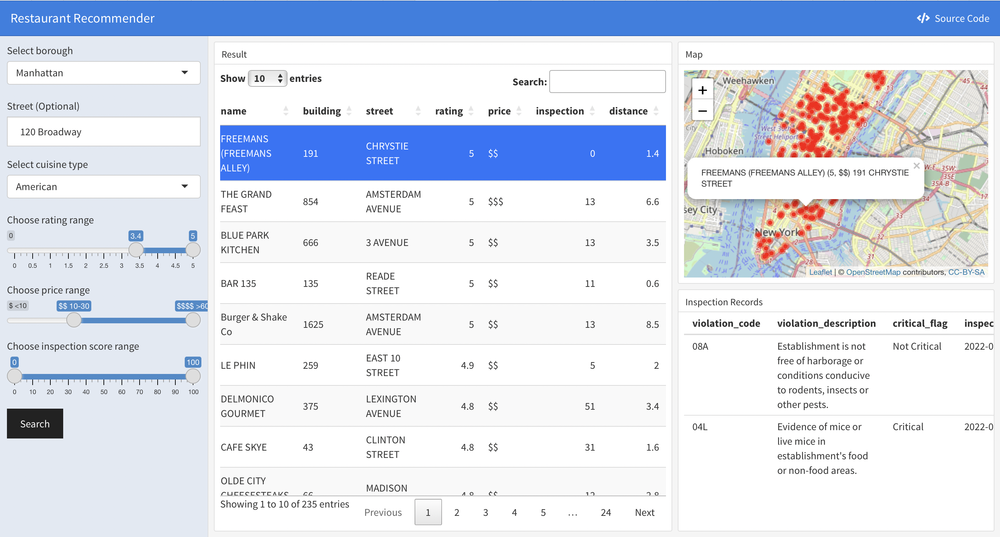

## Motivation

One metric consistently missing in restaurant recommendation apps is the consideration for sanitary conditions. Combining the Inspection dataset and ratings information from the most popular rating website Yelp, we provide recommendations for restaurants in NYC based on one’s choice of price range, sanitary grading, location, and cuisine type. Furthermore, we provide statistical analysis on whether sanitary grades depend on which borough one is dining in, which cuisine type one chooses, which price range the given restaurant is. This provides formal analysis that could potentially guide consumers on which types of restaurants to choose if they wish to avoid health hazards as much as possible. Finally, we fit multiple linear regression models on Yelp rating and attempt to understand which predictors to be statistically significant. The motivation on this front is to potentially provide insight for investors in the culinary industry on which measures to take (e.g., which borough should they open their restaurant, which price range should they shoot for, how much they should invest in sanitary conditions for the restaurant, etc.) if they wish to ensure the best ratings from platforms like Yelp.

## Initial Questions

* What are th

* What is the relationship between reviewer's rating of the restaurant and other variables including inspection score, boroughs, price range, review numbers, cuisine type.

## Related Work

## Data Collection and Cleaning

We used two data sets to complete our analysis. 

### a. [DOHMH NYC Restaurant Inspection Data](https://data.cityofnewyork.us/Health/DOHMH-New-York-City-Restaurant-Inspection-Results/43nn-pn8j)

This dataset provided by Department of Health and Mental Hygiene (DOHMH) contains detailed information on restaurant inspection results. We downloaded and imported the version updated on Nov. 17th. 
Since this file is too large to be uploaded on Github, we configured Github Large File System to store it and its cleaning results. 

In the process of data cleaning, we formatted variables, identified illegal values and dropped NAs. The distinct restaurants are filtered to be our targets. 

After cleaning, we are mainly focus on variables shown below:

  - `score`: Total score for a particular inspection. The higher the score, the lower the performance and riskier the health hazards.
  
  - `grade`: Grade associated with the inspection. The lower the score, the higher (alphabetically) the grade. 
  
  - `violation_description`: Violation description associated with the  inspection. 
  
  - `critical_flag`: Indicator of critical violation. 

### b. [Yelp Data](https://www.yelp.com/search?find_desc=Restaurants&find_loc=New+York%2C+NY)

After selecting the first 8000 distinct restaurant with latest inspection records, we extracted their name and location information to generate Yelp searching URLs, and used the corresponding CSS tags to pull real-time information for each restaurant, which includes: 

  - `name`: Restaurant's name. 
  
  - `rating`: Overall rating score given by Yelp users.
  
  - `review_num`: Number of reviews for a specific restaurant.

  - `price`: Average consuming price range for a specific restaurant.
  
  - `distance`: Distance between target location and searching result.

Finally, due to the instability of the website display, we got 6943 restaurants' yelp information in total and kept 6053 entries which were joined with the inspection dataset for subsequent analysis. 

## Exploratory analysis

For our exploratory analyses, we aimed to identify patterns related to inspection information and cuisine types across different boroughs and price levels. Meanwhile, the latent associations between sanitary grading, inspection-related variables, review numbers, and rating are our particular interests. The exploratory analyses consisted of two main parts: visualization and mapping of cuisine types and ratings in different boroughs and at price levels, visualization and mapping of critical inspection information.

### Visulization of cuisine types and ratings in NYC

Based on our data frame, we get the top 10 popular cuisine types in NYC and in different boroughs across NYC. `American`, `Chinese` are always among people's favorites, while citizens in different boroughs shows their different preferences. Then, we visualized the pattern of the top 10 frequent cuisine at different price, which can be useful when considering the preferences at different levels of consumption. After that, restaurants at different price levels by borough are inspected, and it showed that people living in Manhattan were associated with higher consumption level.

We then discovered the association between review number and review scores. Living in a era full of bots and artificial intelligence, it's interesting to have some inspection on them. We found that for restaurants which got raring scores lower than 3, the review numbers tended to be very small. Meanwhile, the review scores by price levels were visualized. At last, we mapped the geolocation of restaurants by price and cuisine types. In general, Manhattan has the largest number of restaurants and a much denser distribution compared to other boroughs. The proportion of the least and second least expensive restaurants are much higher compared to the proportions of more expensive dining places in Bronx, Queens, Brooklyn, and Staten Island. In addition, the majority of the restaurants that fall into the most expensive category are located in Manhattan.

### Distribution of Restaurants by Price

As demonstrated by a map, we explored the underlying distribution of restaurants in NYC with respect to price and borough. In general, Manhattan had the largest number of restaurants and a much denser distribution compared to other boroughs. The proportion of the least and second least expensive restaurants were much higher compared to the proportions of more expensive dining places in Bronx, Queens, Brooklyn, and Staten Island. In addition, the majority of the restaurants that fell into the most expensive category (`$$$$`) were located in Manhattan. 

### Violation 

There were a total of 169 distinct types of violations documented for NYC restaurants, and one restaurant might have fallen into more than one category. After grouping the data by the types of violation, we identified the 10 most frequent violations to gain an understanding of the general problems faced by the restaurants. 

Depending on the seriousness of the violations, Health Code violations are categorized as "critical" or "general (not critical)". Hence, we also calculated the proportions of violations made by each that was categorized as "critical". We found that more than 50 percent of the violations were not critical. In addition, the ratio of critical to non-critical violations was approximately the same across different boroughs of NYC.

We then generated a density heat map to identify an underlying pattern of the distribution of critical flags. According to the density heat map, restaurants with critical violations were more frequently found in some of the busier area of each borough: for instance, Soho and West Village in lower Manhattan, Korean Town in middle Manhattan, Williamsburg in Brooklyn, Jackson Heights and Main Street in Queens, etc. 

In terms of the performance during inspection, the majority of the restaurants in NYC received an "A" as the inspection grade, either during the initial inspection or re-inspection. Among all boroughs in NYC, Bronx was the one with the highest proportion of restaurants receiving a grade "C". Staten Island had the highest proportion of restaurants with grade "A" and no restaurant with grade "C", followed by Manhattan which had the second highest proportion of grade "A" restaurants. 

## Statistical Analysis

## Shiny app

We developed and deployed an Shiny App for users to get appropriate and interactive recommendations based on their personalized input. 
The interactive app gives user the freedom whether to input a target street. When a text input of street is received, it will be converted to a longitude and latitude coordinate using API provided by [NYC GeoSearch](https://geosearch.planninglabs.nyc/docs/), and the distance between each resulting restaurant and the target location will be calculated and displayed in the resulting table. 

Once clicking the "Search" button, users can view key information for each restaurant satisfying their demands from the resulting table and see the location distribution on the map. 
While the table is sorted by rating values by default, it can be sorted by each variables based on users' preference. 
By clicking a specific entry of the table, the latest inspection records of the corresponding restaurant will be shown in the lower right.

